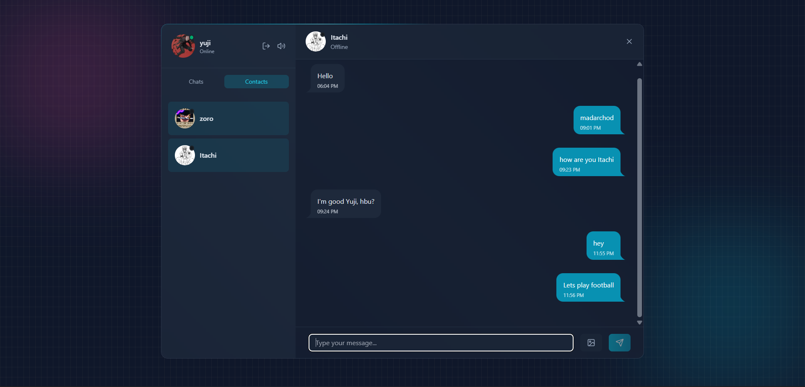
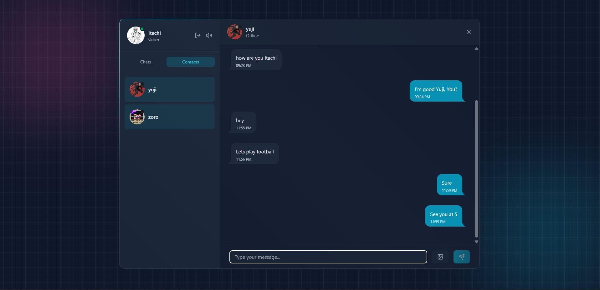
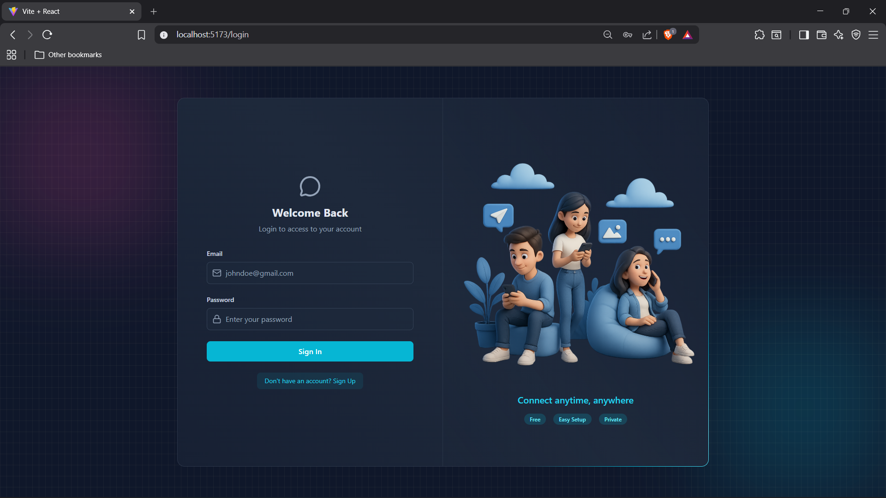
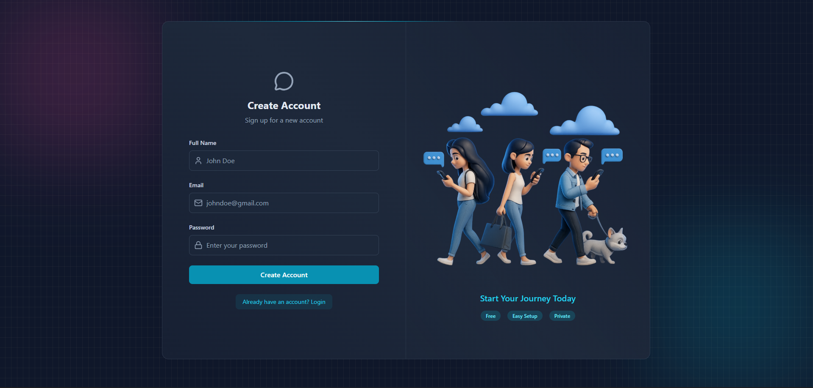

🚀 Squabble – Real-Time Full-Stack Chat App

✨ Squabble is a modern full-stack real-time chat application built with the MERN stack.
It features secure JWT authentication, live messaging with Socket.io, online presence tracking, and a sleek UI.

✨ Features

🔐 Custom JWT Authentication (No third-party auth)
⚡ Real-time Messaging via Socket.io
🟢 Online / Offline Presence Indicators
🔔 Typing & Message Notification Sounds (toggle supported)
🗂️ Image Uploads with Cloudinary
🧰 RESTful API using Express.js
🧱 MongoDB for data persistence
🎨 Modern UI with Tailwind CSS + DaisyUI
🧠 Zustand for global state management

⚙️ Environment Setup

Create a .env file inside the backend folder:

PORT=3000
MONGO_URI=your_mongo_uri_here

NODE_ENV=development

JWT_SECRET=your_super_secret_key

CLIENT_URL=http://localhost:5173

CLOUDINARY_CLOUD_NAME=your_cloud_name
CLOUDINARY_API_KEY=your_api_key
CLOUDINARY_API_SECRET=your_api_secret

## 🔧 Run the Backend

```bash
cd backend
npm install
npm run dev
```

## 💻 Run the Frontend

```bash
cd frontend
npm install
npm run dev
```


# 📸 Screenshots

## 💬 Chat Interface


## 💬 Live Messaging


## 🔐 Login Page


## 📝 Signup Page


